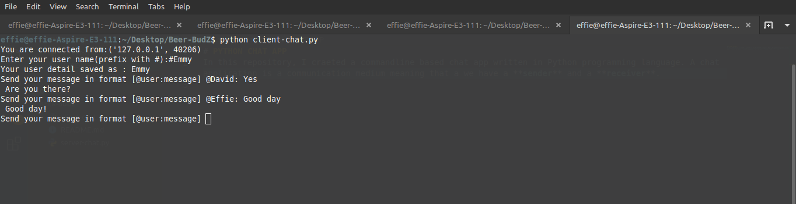
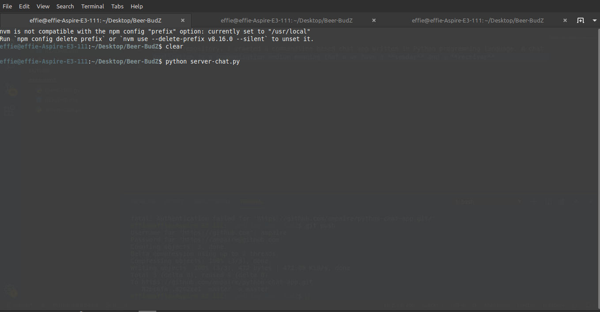
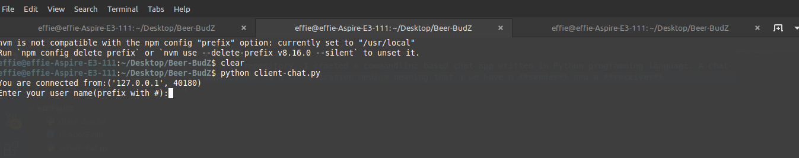
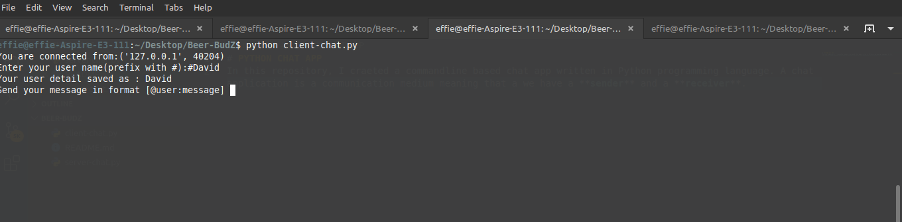
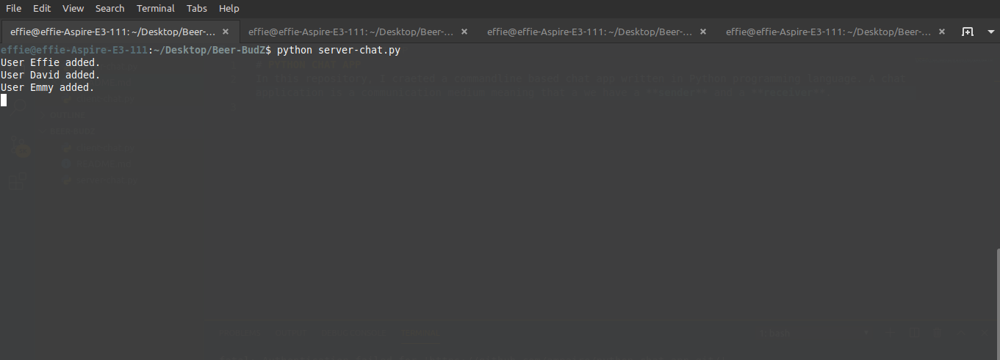

# <h1 align = "center">PYTHON CHAT APP </h1>

In this repository, I created a chat app written in Python programming language. A chat application is a communication medium meaning that we have a **sender** and a **receiver**.

## FEATURES
- Built with python and sockets.
- This app is run in the terminal.
- Signs in up to five users.

## RUNNING THE APPLICATION
  Since the application is run in the terminal, we do not need so much, Just a few prerequisites.

### PREREQUISITES
- Knowledge on how to use the terminal.
- Python installed(modern editors like VScode have an option of installing python right from the extensions).

And then we are good to go.

### RUNNING THE APPLICATION

1. Open a terminal and Run  ``python server-chat.py``

2. Open a new terminal and run ``python client-chat.py``. Type your name beginning with #

3. You can open terminals for up to five users

4. Each user that is added will be displayed in our first terminal where we run ``server-chat.py``

5. You can now start sending messages in the formart **@user: message**

## FUTURE IMPROVEMENTS
- Proper user authentication
- Improve validations

## AUTHOR
- Github -- [@ampaire](https://github.com/ampaire)
- Twitter -- [@AmpaPhem](https://twitter.com/AmpaPhem)
- LinkedIn -- [Ampaire Phemia](https://www.linkedin.com/in/phemia)`

